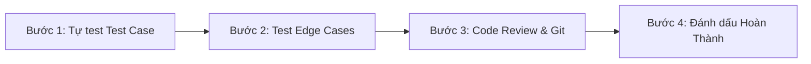

# Quy Tắc Đánh Giá Hoàn Thành (Definition of Done & Verification Checklist)

> **Mục đích:** Bản ghi nhớ (cheat-sheet / checklist) dành riêng cho người kiểm tra trước khi tích **HOÀN THÀNH** cho bất kỳ tính năng nào trong [`../project-progress.xlsx`](../project-progress.xlsx) hoặc merge nhánh Git vào `develop`/`master`.
> **Nguyên tắc cốt lõi:** *"Code xong chưa phải là xong. Chỉ xong khi đã kiểm thử thực tế, đạt tiêu chí chấp nhận và không phát sinh lỗi."*

---

## 1. Tiêu Chuẩn Hoàn Thành Chung (General DoD)

Mọi tính năng/nhiệm vụ chỉ được coi là **HOÀN THÀNH** khi vượt qua toàn bộ 6 tiêu chí sau:

- [ ] **1. Đúng kiến trúc MVVM & Chuẩn code:**
  - View (Activity/Fragment) chỉ xử lý tương tác UI và quan sát `LiveData`.
  - Nghiệp vụ & logic dữ liệu nằm trong `ViewModel` và `Repository`.
  - Tuyệt đối không dùng `findViewById` (dùng ViewBinding 100%).
  - Code viết bằng **Java 17**, tương thích `minSdk` 26 (Android 8.0+).
- [ ] **2. Xử lý bất đồng bộ & Ngoại lệ chặt chẽ:**
  - Mọi thao tác Firebase đều có callback `addOnSuccessListener` và `addOnFailureListener`.
  - Có thông báo thân thiện (Toast, Snackbar, Dialog) khi thất bại, **không bao giờ để app crash hoặc treo vô tận (vòng quay tải vô hạn)**.
- [ ] **3. Bảo mật hai lớp (UI & Server-side):**
  - Giao diện ẩn/vô hiệu hóa các nút không thuộc vai trò (`PermissionHelper`).
  - Firestore Rules (`firestore.rules`) chặn đứng thao tác ghi trái phép từ server.
- [ ] **4. Kiểm thử thực tế trên thiết bị/máy ảo:**
  - Đã chạy thử ít nhất 1 lần trên máy ảo/thiết bị thật API 26+.
  - Không có lỗi nghiêm trọng (Fatal Exception) trong Logcat.
- [ ] **5. Thử nghiệm trường hợp biên (Edge Cases):**
  - Nhập rỗng, nhập dấu cách, nhập ký tự đặc biệt tiếng Việt, nhập số âm/quá lớn.
  - Kiểm tra trạng thái offline (mất mạng): app không văng, hiện badge cảnh báo hoặc thông báo phù hợp.
- [ ] **6. Git & Quản lý nhánh:**
  - Commit theo đúng Conventional Commits (ví dụ: `feat(student): ...`, `fix(auth): ...`).
  - Không commit file nhạy cảm (`google-services.json`, `.idea/workspace.xml`).

---

## 2. Checklist Kiểm Tra Theo Từng Module Nghiệp Vụ

### 2.1 Module Tài Khoản & Xác Thực (Auth)
*Người kiểm tra: Đối chiếu với FR-ACC-01 đến FR-ACC-04 và TC-01 đến TC-04, TC-22, TC-26*

- [ ] **Đăng nhập hợp lệ:** Nhập đúng email/mật khẩu ➔ Chuyển đúng màn hình chính theo vai trò.
- [ ] **Đăng nhập sai:** Nhập sai email hoặc mật khẩu ➔ Báo lỗi rõ ràng, không crash.
- [ ] **Kiểm tra tài khoản Khóa (`Locked`):**
  - Tài khoản có `status == "Locked"` trong `users/{uid}` ➔ Từ chối đăng nhập, đăng xuất khỏi Firebase Auth, hiện cảnh báo *"Tài khoản của bạn đã bị khóa"*.
- [ ] **Tài khoản mồ côi (không có document `users/{uid}`):** Từ chối đăng nhập, hiện thông báo lỗi dữ liệu.
- [ ] **Tự động Seed Admin lần đầu (FR-ACC-04):**
  - Cài app trên máy ảo mới hoàn toàn ➔ App tự tạo tài khoản `admin@student.app` / `Admin@123456` với document Firestore `role: "admin"`, `status: "Normal"`.
- [ ] **Ghi lịch sử đăng nhập:**
  - Đăng nhập thành công ➔ Document mới được tạo trong `users/{uid}/loginHistory/` với server timestamp.
- [ ] **Đổi ảnh đại diện:**
  - Chọn ảnh từ thư viện ➔ Tải lên Firebase Storage `avatars/{uid}.jpg` ➔ Cập nhật `avatarUrl` trong `users/{uid}` ➔ Giao diện cập nhật ảnh mới ngay lập tức.

---

### 2.2 Module Quản Lý Người Dùng (User Management - Chỉ Admin)
*Người kiểm tra: Đối chiếu với FR-USR-01 đến FR-USR-06 và TC-05 đến TC-08, TC-23*

- [ ] **Chặn quyền:** Manager và Employee mở app không thấy nút/màn hình Quản lý người dùng. Nếu gọi trực tiếp thì Firestore Rules từ chối.
- [ ] **Danh sách người dùng:** Hiển thị đủ tên, tuổi, SĐT, vai trò, trạng thái.
- [ ] **Tạo người dùng mới (Admin không bị văng đăng nhập):**
  - Dùng `FirebaseApp` phụ (secondary instance) để gọi `createUserWithEmailAndPassword`.
  - Sau khi tạo xong, tài khoản Admin hiện tại **vẫn giữ nguyên phiên đăng nhập**.
  - Document `users/{new_uid}` được tạo đầy đủ các trường: `uid`, `email`, `name`, `age`, `phone`, `status`, `role`, `createdAt`.
- [ ] **Xác thực dữ liệu form:**
  - Tuổi không phải 18–60 ➔ Báo lỗi cụ thể tại ô nhập.
  - SĐT không đủ 10 số hoặc không bắt đầu bằng số 0 ➔ Báo lỗi.
  - Email sai định dạng hoặc mật khẩu dưới 6 ký tự ➔ Báo lỗi.
- [ ] **Khóa / Mở khóa:** Đổi `status` giữa `Normal` và `Locked` tức thì trên giao diện và Firestore.
- [ ] **Xem lịch sử đăng nhập:** Xem được danh sách thời gian và thiết bị đăng nhập của người dùng được chọn.

---

### 2.3 Module Sinh Viên & Chứng Chỉ (Student & Certificate)
*Người kiểm tra: Đối chiếu với FR-STU-01 đến FR-STU-07, FR-CER-01 đến FR-CER-04 và TC-09 đến TC-15, TC-21, TC-25*

- [ ] **Đồng bộ thời gian thực (Realtime Sync):**
  - Mở app trên 2 thiết bị (hoặc 1 máy thật + 1 máy ảo).
  - Thiết bị 1 thêm/sửa/xóa sinh viên ➔ Thiết bị 2 nhìn thấy danh sách thay đổi trong vòng **dưới 2 giây** mà không cần reload.
- [ ] **Ràng buộc trường dữ liệu sinh viên:**
  - Bắt buộc đủ 5 trường: Mã SV, Họ tên, Ngày sinh (`YYYY-MM-DD`), Lớp, Khoa.
  - Khi sửa sinh viên: **Không cho phép sửa Mã SV** (vì Mã SV là Document ID).
- [ ] **Tìm kiếm đa tiêu chí (Client-side):**
  - Tìm theo Tên (hỗ trợ tiếng Việt có dấu đầy đủ như "Nguyễn", "Đặng", "Bùi").
  - Tìm theo Mã SV, Lớp, Khoa hoặc kết hợp.
  - Xóa ô tìm kiếm ➔ Danh sách khôi phục đầy đủ ngay lập tức.
- [ ] **Sắp xếp đa tiêu chí:**
  - Sắp xếp Tên A–Z / Z–A (đúng bảng chữ cái tiếng Việt).
  - Sắp xếp Ngày sinh tăng/giảm.
- [ ] **Chứng chỉ (Subcollection):**
  - Thêm chứng chỉ: Chứng chỉ xuất hiện đúng trong subcollection `students/{studentId}/certificates/{certId}`.
  - Xóa sinh viên: **Bắt buộc xóa sạch toàn bộ subcollection `certificates`** của sinh viên đó trước khi xóa document sinh viên (tránh document mồ côi).
- [ ] **Phân quyền Employee:** Employee bấm vào chỉ được xem chi tiết, không thấy nút Thêm/Sửa/Xóa.

---

### 2.4 Module Import & Export CSV
*Người kiểm tra: Đối chiếu với FR-IO-01 đến FR-IO-04 và TC-16 đến TC-20, TC-24, TC-27*

- [ ] **Storage Access Framework (SAF):** Sử dụng `ActivityResultContracts.OpenDocument` / `CreateDocument` để người dùng chọn file chuẩn Android.
- [ ] **Mã hóa UTF-8:**
  - File import có dấu tiếng Việt (như `sample-data/students.csv`) đọc vào không bị lỗi font/vỡ ký tự.
  - Đọc được cả UTF-8 có BOM và không có BOM.
  - File export tải ra khi mở bằng Microsoft Excel tiếng Việt hiển thị chuẩn 100% (nhờ UTF-8 BOM `\uFEFF`).
- [ ] **Báo cáo lỗi dòng khi Import (`sample-data/students-invalid.csv`):**
  - Bỏ qua dòng thiếu Mã SV hoặc sai định dạng ngày.
  - Hiện dialog/thông báo chi tiết: *"Đã import thành công X dòng, bỏ qua Y dòng lỗi (Dòng 3: thiếu Mã SV)"*.
- [ ] **Ghi theo Batch:**
  - Nếu file có trên 500 dòng ➔ Phải chia thành các `WriteBatch` nhỏ (≤ 500 operations/batch).
- [ ] **Import chứng chỉ:** Khớp đúng `studentId` vào sinh viên đã tồn tại. Nếu `studentId` không tồn tại trong Firestore ➔ Báo lỗi dòng đó.

---

## 3. Quy Trình 4 Bước Đánh Dấu Hoàn Thành

1. **Bước 1: Chạy Test Case tương ứng**
   - Mở file [`test-and-setup.md`](test-and-setup.md), tìm mã test case liên quan (ví dụ TC-09, TC-16...).
   - Thực hiện từng bước (Action) và kiểm tra kết quả mong đợi (Expected).
2. **Bước 2: Quét lỗi ngầm (Edge-case check)**
   - Xoay màn hình (orientation change) xem Activity/Fragment có bị mất dữ liệu hay crash không.
   - Thử bấm nút 2 lần liên tiếp (double click) xem có bị tạo 2 bản ghi trùng lặp không.
   - Tắt Wifi/4G xem app phản ứng thế nào.
3. **Bước 3: Kiểm tra Git & Logcat**
   - Mở Logcat gõ tag của ứng dụng xem có exception/warning tiềm ẩn nào không.
   - Kiểm tra `git status` đảm bảo không có file lạ rác.
4. **Bước 4: Cập nhật tài liệu tiến độ**
   - Mở file [`../project-progress.xlsx`](../project-progress.xlsx).
   - Chuyển trạng thái từ `Đang làm` ➔ `Hoàn thành`.
   - Điền số giờ thực tế đã dùng.
