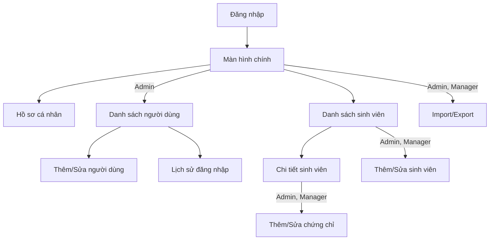

# Thiết Kế Hệ Thống

Các biểu đồ UML (use case, lớp, ER, tuần tự) nằm ở [`uml.md`](uml.md). Cấu trúc dữ liệu ở [`firestore-schema.md`](firestore-schema.md).

## 1. Kiến trúc MVVM

```
┌─────────────────────────────────────────┐
│           Tầng Giao diện (UI)           │
│  Activities / Fragments / Adapters      │
└──────────────┬──────────────────────────┘
               │ observe LiveData
┌──────────────▼──────────────────────────┐
│          ViewModel                      │
│  Xử lý logic UI, giữ trạng thái         │
└──────────────┬──────────────────────────┘
               │ gọi
┌──────────────▼──────────────────────────┐
│          Repository                     │
│  Trung gian giữa ViewModel & Firebase   │
└──────────────┬──────────────────────────┘
               │ gọi SDK
┌──────────────▼──────────────────────────┐
│  Firebase Auth / Firestore / Storage    │
└─────────────────────────────────────────┘
```

Ứng dụng dùng **hai Activity**: `LoginActivity` (đăng nhập) và `MainActivity` (chứa Navigation Component, các màn hình còn lại là Fragment). Mọi thao tác Firebase nằm trong Repository.

## 2. Phân chia package (`com.example.studentmgmt`)

| Package | Nội dung |
|---|---|
| `model/` | `User`, `Student`, `Certificate`, `LoginRecord` |
| `data/firebase/` | `FirebaseClient` (cấu hình Firebase, instance dùng chung) |
| `data/repository/` | `AuthRepository`, `UserRepository`, `StudentRepository`, `CertificateRepository` |
| `viewmodel/` | `AuthViewModel`, `UserViewModel`, `StudentViewModel`, `CertificateViewModel` |
| `ui/auth/` | `LoginActivity` |
| `ui/common/` | `HomeFragment` (màn hình chính, mục điều hướng theo vai trò) |
| `ui/user/` | `UserListFragment`, `UserEditFragment`, `LoginHistoryFragment` |
| `ui/student/` | `StudentListFragment`, `StudentDetailFragment`, `StudentEditFragment`, `ImportExportFragment` |
| `ui/certificate/` | `CertificateEditFragment` |
| `ui/profile/` | `ProfileFragment` (đổi avatar, lịch sử đăng nhập của mình) |
| `adapter/` | `UserAdapter`, `StudentAdapter`, `CertificateAdapter`, `LoginRecordAdapter` |
| `utils/` | `CsvHelper`, `ValidationUtils`, `DateUtils`, `PermissionHelper`, `Constants` |
| `service/` | `AdminSeedService` (tạo tài khoản Admin lần đầu) |

Trạng thái hiện tại: mới có khung dự án (`MainActivity` và các thư mục rỗng). Các lớp trên là thiết kế đích.

## 3. Danh sách màn hình

| Màn hình | Vai trò | Chức năng chính | FR liên quan |
|---|---|---|---|
| Đăng nhập (`LoginActivity`) | Tất cả | Email/mật khẩu, kiểm tra `Locked` | FR-ACC-01 |
| Màn hình chính (`HomeFragment`) | Tất cả | Hiện các mục theo vai trò (xem sơ đồ dưới) | – |
| Hồ sơ cá nhân | Tất cả | Đổi avatar, xem lịch sử đăng nhập của mình | FR-ACC-02, FR-ACC-03 |
| Danh sách người dùng | Admin | Xem, xóa, khóa/mở khóa | FR-USR-01, 04, 05 |
| Thêm/Sửa người dùng | Admin | Form nhập liệu | FR-USR-02, 03 |
| Lịch sử đăng nhập của người dùng | Admin | Xem theo từng người dùng | FR-USR-06 |
| Danh sách sinh viên | Tất cả | Xem, tìm kiếm, sắp xếp | FR-STU-01, 05, 06 |
| Chi tiết sinh viên | Tất cả | Thông tin đầy đủ + danh sách chứng chỉ | FR-STU-07, FR-CER-01 |
| Thêm/Sửa sinh viên | Admin, Manager | Form nhập liệu | FR-STU-02, 03, 04 |
| Thêm/Sửa chứng chỉ | Admin, Manager | Form nhập liệu | FR-CER-02, 03, 04 |
| Import/Export | Admin, Manager | Chọn file, xem kết quả | FR-IO-01..04 |


*Hình: Sơ đồ điều hướng theo vai trò. Employee chỉ thấy các mục không có nhãn vai trò.*

## 4. Quy ước thiết kế

- **Ẩn chức năng theo vai trò:** `PermissionHelper` quyết định hiện hoặc ẩn nút/mục menu. Đây chỉ là lớp tiện dụng, bảo mật thật nằm ở `firestore.rules`.
- **Kiểm tra `Locked`:** thực hiện sau khi Firebase Auth xác thực thành công, đọc `users/{uid}.status`. Nếu `Locked` hoặc không có document thì đăng xuất và báo lỗi.
- **Admin tạo người dùng:** `createUserWithEmailAndPassword` trên instance mặc định sẽ đăng nhập luôn tài khoản mới và làm Admin bị đăng xuất. Dùng một `FirebaseApp` phụ (secondary) để tạo tài khoản, sau đó ghi document `users/{uid}`.
- **Tìm kiếm/sắp xếp:** xử lý phía client trên danh sách mà listener đã tải về (xem `firestore-schema.md` mục 5).
- **Offline:** hiện badge khi mất mạng (NFR-03).
