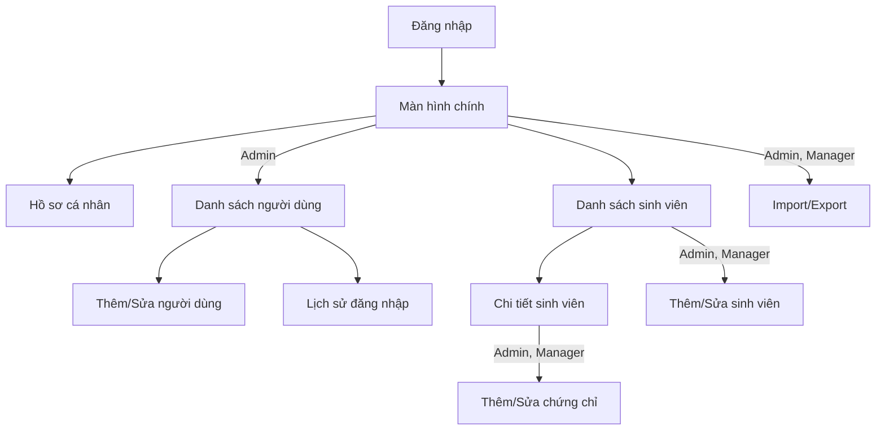

# Thiết Kế Hệ Thống

Các biểu đồ UML (use case, lớp, ER, tuần tự) nằm ở `uml.md`. Cấu trúc dữ liệu ở [`firestore-schema.md`](firestore-schema.md).

> **Trạng thái:** đây là thiết kế đích. Repository hiện mới là khung đang phát triển, chưa có đầy đủ các lớp và màn hình được liệt kê.

## 1. Kiến trúc MVVM

```
┌─────────────────────────────────────────┐
│           Tầng Giao diện (UI)           │
│  Activities / Fragments / Adapters      │
└──────────────┬──────────────────────────┘
               │ observe LiveData
┌──────────────▼──────────────────────────┐
│          ViewModel                      │
│  Xử lý logic UI, giữ trạng thái         │
└──────────────┬──────────────────────────┘
               │ gọi
┌──────────────▼──────────────────────────┐
│          Repository                     │
│  Trung gian giữa ViewModel & Firebase   │
└──────────────┬──────────────────────────┘
               │ gọi SDK
┌──────────────▼──────────────────────────┐
│  Firebase Auth / Firestore / Storage    │
└─────────────────────────────────────────┘
```

Ứng dụng dùng **hai Activity**: `LoginActivity` (đăng nhập) và `MainActivity` (chứa Navigation Component, các màn hình còn lại là Fragment). Mọi thao tác Firebase nằm trong Repository.

## 2. Phân chia package (`com.example.studentmgmt`)

| Package              | Nội dung                                                                                             |
| -------------------- | ----------------------------------------------------------------------------------------------------- |
| `model/`           | `User`, `Student`, `Certificate`, `LoginRecord`                                               |
| `data/firebase/`   | `FirebaseClient` (cấu hình Firebase, instance dùng chung)                                        |
| `data/repository/` | `AuthRepository`, `UserRepository`, `StudentRepository`, `CertificateRepository`              |
| `viewmodel/`       | `AuthViewModel`, `UserViewModel`, `StudentViewModel`, `CertificateViewModel`                  |
| `ui/auth/`         | `LoginActivity`                                                                                     |
| `ui/common/`       | `HomeFragment` (màn hình chính, mục điều hướng theo vai trò)                               |
| `ui/user/`         | `UserListFragment`, `UserEditFragment`, `LoginHistoryFragment`                                  |
| `ui/student/`      | `StudentListFragment`, `StudentDetailFragment`, `StudentEditFragment`, `ImportExportFragment` |
| `ui/certificate/`  | `CertificateEditFragment`                                                                           |
| `ui/profile/`      | `ProfileFragment` (đổi avatar, lịch sử đăng nhập của mình)                                 |
| `adapter/`         | `UserAdapter`, `StudentAdapter`, `CertificateAdapter`, `LoginRecordAdapter`                   |
| `utils/`           | `CsvHelper`, `ValidationUtils`, `DateUtils`, `PermissionHelper`, `Constants`                |

Trạng thái hiện tại: mới có khung dự án với `MainActivity` mẫu. Các lớp và package trên là thiết kế đích. Admin đầu tiên được cấp qua Firebase Console hoặc môi trường máy chủ tin cậy, không có `AdminSeedService` trong ứng dụng client.

## 3. Danh sách màn hình

| Màn hình                                | Vai trò       | Chức năng chính                                  | FR liên quan        |
| ----------------------------------------- | -------------- | --------------------------------------------------- | -------------------- |
| Đăng nhập (`LoginActivity`)          | Tất cả       | Username/mật khẩu; email tùy chọn làm bí danh; kiểm tra `Locked` | FR-ACC-01 |
| Màn hình chính (`HomeFragment`)      | Tất cả       | Hiện các mục theo vai trò (xem sơ đồ dưới) | –                   |
| Hồ sơ cá nhân                         | Tất cả       | Đổi avatar, xem lịch sử đăng nhập của mình | FR-ACC-02, FR-ACC-03 |
| Danh sách người dùng                  | Admin          | Xem, xóa, khóa/mở khóa                          | FR-USR-01, 04, 05    |
| Thêm/Sửa người dùng                  | Admin          | Form nhập liệu                                    | FR-USR-02, 03        |
| Lịch sử đăng nhập của người dùng | Admin          | Xem theo từng người dùng                        | FR-USR-06            |
| Danh sách sinh viên                     | Tất cả       | Xem, tìm kiếm, sắp xếp                          | FR-STU-01, 05, 06    |
| Chi tiết sinh viên                      | Tất cả       | Thông tin đầy đủ + danh sách chứng chỉ      | FR-STU-07, FR-CER-01 |
| Thêm/Sửa sinh viên                     | Admin, Manager | Form nhập liệu                                    | FR-STU-02, 03, 04    |
| Thêm/Sửa chứng chỉ                    | Admin, Manager | Form nhập liệu                                    | FR-CER-02, 03, 04    |
| Import/Export                             | Admin, Manager | Chọn file, xem kết quả                           | FR-IO-01..04         |



*Hình: Sơ đồ điều hướng theo vai trò. Employee chỉ thấy các mục không có nhãn vai trò.*

## 4. Quy ước thiết kế

- **Ẩn chức năng theo vai trò:** `PermissionHelper` quyết định hiện hoặc ẩn nút/mục menu. Đây chỉ là lớp tiện dụng, bảo mật thật nằm ở `firestore.rules`.
- **Kiểm tra `Locked`:** thực hiện sau khi Firebase Auth xác thực thành công, đọc `users/{uid}.status`. Nếu `Locked` hoặc không có document thì đăng xuất và báo lỗi.
- **Cấp Admin đầu tiên:** thực hiện trong Firebase Console hoặc qua Admin SDK/Cloud Functions. Ứng dụng client không được tự bootstrap Admin.
- **Admin tạo người dùng:** username là bắt buộc, email là tùy chọn. Việc cấp thông tin xác thực phải đi qua môi trường tin cậy; không lưu mật khẩu thô trong Firestore. Nếu chọn Firebase Email/Password, cần một lớp ánh xạ username/email sang tài khoản Auth và phải tuân thủ mật khẩu tối thiểu 6 ký tự.
- **Tìm kiếm/sắp xếp:** xử lý phía client trên danh sách mà listener đã tải về (xem `firestore-schema.md` mục 5).
- **Offline:** hiện badge khi mất mạng (NFR-03).

---

## 5. Quy ước đặt tên & Chuẩn viết mã (Coding & Naming Conventions)

Để đảm bảo nhóm 2 người phát triển độc lập không bị xung đột phong cách mã nguồn, toàn bộ dự án tuân thủ nghiêm ngặt các quy tắc sau:

### 5.1 Ngôn ngữ & Phong cách chung
- **Mã nguồn (Java/Kotlin, Class, Method, Variable, DB):** Sử dụng **tiếng Anh 100%**. Tuyệt đối không đặt tên biến hoặc lớp lai tạp (ví dụ: không dùng `SinhVien`, `chungChiList`, `tenSinhVien`).
- **Giao diện người dùng (UI String, Toast, Dialog, Lỗi):** Sử dụng **tiếng Việt có dấu**, lịch sự, rõ nghĩa (định nghĩa trong `res/values/strings.xml`).

---

### 5.2 Quy ước đặt tên Lớp, Giao diện & Enum (PascalCase)

| Thành phần | Quy tắc đặt tên | Ví dụ thực tế |
|---|---|---|
| **Model / Entity** | Danh từ đơn số chỉ đối tượng dữ liệu | `User`, `Student`, `Certificate`, `LoginRecord` |
| **Repository** | `{Entity}Repository` | `AuthRepository`, `UserRepository`, `StudentRepository`, `CertificateRepository` |
| **ViewModel** | `{Feature/Entity}ViewModel` | `AuthViewModel`, `UserViewModel`, `StudentViewModel`, `CertificateViewModel` |
| **Activity** | `{Feature}Activity` | `LoginActivity`, `MainActivity` |
| **Fragment** | `{Feature/Action}Fragment` | `StudentListFragment`, `StudentDetailFragment`, `StudentEditFragment`, `ImportExportFragment` |
| **Adapter (RecyclerView)** | `{Entity}Adapter` | `StudentAdapter`, `CertificateAdapter`, `UserAdapter`, `LoginRecordAdapter` |
| **Helper / Utility** | `{Chức năng}Helper` hoặc `{Chức năng}Utils` | `CsvHelper`, `ValidationUtils`, `DateUtils`, `PermissionHelper` |
| **Enum** | Danh từ số ít, giá trị viết HOA | `UserRole { ADMIN, MANAGER, EMPLOYEE }`, `UserStatus { NORMAL, LOCKED }` |

---

### 5.3 Quy ước đặt tên Phương thức / Hàm (camelCase, Động từ + Danh từ)

- **Lấy dữ liệu:** Bắt đầu bằng `get...`, `fetch...`, `observe...` (ví dụ: `getStudentById(String id)`, `observeStudentsRealtime()`).
- **Thao tác ghi (C/U/D):** Bắt đầu bằng `add...`, `create...`, `update...`, `delete...` (ví dụ: `addStudent(Student s)`, `updateUserStatus(String uid, UserStatus status)`, `deleteStudentCascade(String id)`).
- **Kiểm tra trạng thái (Trả về Boolean):** Bắt đầu bằng `is...`, `has...`, `can...` (ví dụ: `isLocked()`, `hasWritePermission(UserRole role)`, `isValidEmail(String email)`).
- **Sự kiện UI / Listener:** Bắt đầu bằng `on...` hoặc `handle...` (ví dụ: `onLoginClicked()`, `onStudentSelected(Student s)`, `handleCsvImport(Uri uri)`).

---

### 5.4 Quy ước đặt tên Biến & Hằng số

| Loại định danh | Quy ước | Ví dụ |
|---|---|---|
| **Biến cục bộ / Thuộc tính** | camelCase | `studentList`, `currentUser`, `selectedStudentId`, `searchQuery` |
| **Biến trạng thái (Boolean)** | camelCase với tiền tố `is/has/isLoading` | `isLoading`, `isLocked`, `isSearchActive` |
| **Hằng số tĩnh (static final / const)** | UPPER_SNAKE_CASE | `MAX_BATCH_SIZE = 400`, `DEFAULT_PAGE_SIZE = 20`, `DATE_FORMAT = "dd/MM/yyyy"` |
| **Collection Firestore** | UPPER_SNAKE_CASE | `COLLECTION_USERS = "users"`, `COLLECTION_STUDENTS = "students"`, `SUB_CERTIFICATES = "certificates"` |

---

### 5.5 Quy ước đặt tên Trường CSDL Firestore (camelCase)

Tất cả document field trong Cloud Firestore đều dùng **camelCase**, thống nhất giữa CSDL và Model:
- **`users`:** `uid`, `username`, `email` (tùy chọn), `name`, `age`, `phone`, `status`, `role`, `avatarUrl`, `createdAt`
- **`students`:** `studentId`, `name`, `dateOfBirth`, `className`, `faculty`, `createdAt`
- **`certificates`:** `certName`, `issueDate`, `issuedBy`
- **`loginHistory`:** `timestamp`, `device`

`studentId` là document ID, khớp `^[0-9A-H][0-9]{2}[0H][0-9]{4}$`; `className` khớp `^[0-9A-Z]{8}$`. Ứng dụng chỉ kiểm tra, không tự sinh MSSV.

---

### 5.6 Quy ước đặt tên Tài nguyên Android (XML Resource - snake_case)

#### 1. Tệp Giao diện (Layout XML): `{tiền tố}_{tên màn hình}.xml`
- Activity: `activity_login.xml`, `activity_main.xml`
- Fragment: `fragment_student_list.xml`, `fragment_student_detail.xml`, `fragment_user_list.xml`, `fragment_profile.xml`
- Item RecyclerView: `item_student.xml`, `item_certificate.xml`, `item_user.xml`, `item_login_record.xml`
- Dialog: `dialog_filter_student.xml`, `dialog_confirm_delete.xml`

#### 2. Định danh ID trong Layout: `{tiền tố view}_{mục đích}`
- **Button:** `btn_login`, `btn_save`, `btn_cancel`, `btn_import_csv`
- **TextInput / EditText:** `edt_login_identifier`, `edt_email`, `edt_password`, `edt_student_id`, `edt_student_name`, `edt_phone`
- **TextView:** `tv_title`, `tv_student_name`, `tv_class_name`, `tv_role`, `tv_status`
- **RecyclerView:** `rv_students`, `rv_certificates`, `rv_users`
- **ImageView:** `img_avatar`, `img_icon_search`
- **ProgressBar / Skeleton:** `pb_loading`, `skeleton_container`
- **FloatingActionButton:** `fab_add_student`, `fab_add_certificate`

#### 3. Tệp Drawable, Color & String
- Icon: `ic_search.xml`, `ic_filter.xml`, `ic_add.xml`, `ic_edit.xml`, `ic_delete.xml`
- Background: `bg_rounded_card.xml`, `bg_badge_locked.xml`
- Color: `color_primary`, `color_secondary`, `color_status_locked`, `color_status_normal`
