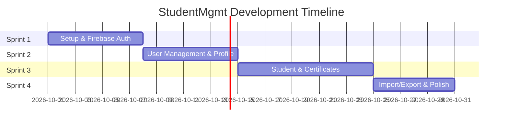

# Project Plan

## 1. Project Overview
A 4-sprint development plan for the Student Management Android Application.

## 2. Project Phases & Sprints

### Sprint 1: Setup & Core Foundation
- Project setup (Android Studio, Java, Kotlin DSL).
- Firebase project initialization (Firestore, Auth, Storage).
- Basic UI shell & Navigation structure.

### Sprint 2: Authentication & User Management
- Login screen & Firebase Auth integration.
- Admin user management module.
- User profile & avatar management.

### Sprint 3: Student & Certificate Operations
- Student CRUD module with realtime Firestore listeners.
- Certificate sub-collection CRUD.
- Search, filter, and sorting features.

### Sprint 4: Import/Export, Testing & Final Polish
- CSV Import/Export functionality.
- Unit testing & UI testing.
- Documentation & final release.

## 3. Project Timeline (Gantt Chart)

