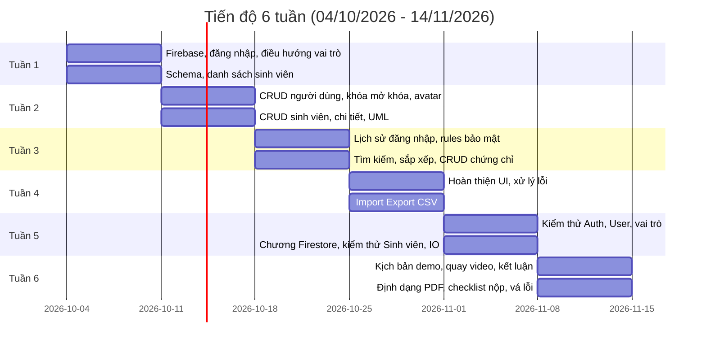

# Kế Hoạch Dự Án và Cấu Trúc Công Việc (WBS)

Dự án chia theo **6 tuần** (04/10/2026 → 14/11/2026). Ai làm gì mỗi tuần: [`team-work-distribution.md`](team-work-distribution.md). Chi tiết từng công việc và trạng thái: [`../project-progress.xlsx`](../project-progress.xlsx).

## 1. Cấu trúc công việc (WBS)

```
1. Ứng dụng Quản lý Thông tin Sinh viên Thời gian Thực
├── 1.1 Yêu cầu và thiết kế
│   ├── 1.1.1 Phân tích đề bài (Mid-term.pdf)
│   ├── 1.1.2 Viết SRS, schema, biểu đồ UML
│   └── 1.1.3 Dựng project Android (Java 17, minSdk 26, Kotlin DSL)
├── 1.2 Hạ tầng Firebase
│   ├── 1.2.1 Cấu hình Authentication, Firestore, Storage
│   ├── 1.2.2 Viết firestore.rules
│   └── 1.2.3 Seed tài khoản Admin tích hợp sẵn (admin@student.app)
├── 1.3 Tài khoản và người dùng
│   ├── 1.3.1 Đăng nhập, kiểm tra Locked, điều hướng theo vai trò
│   ├── 1.3.2 Đổi ảnh đại diện (Firebase Storage)
│   ├── 1.3.3 CRUD người dùng, khóa/mở khóa (chỉ Admin)
│   └── 1.3.4 Ghi và xem lịch sử đăng nhập
├── 1.4 Sinh viên và chứng chỉ
│   ├── 1.4.1 Danh sách sinh viên với listener thời gian thực
│   ├── 1.4.2 CRUD sinh viên (Mã SV, Họ tên, Ngày sinh, Lớp, Khoa)
│   ├── 1.4.3 Tìm kiếm và sắp xếp đa tiêu chí (phía client)
│   └── 1.4.4 Trang chi tiết và CRUD chứng chỉ (subcollection)
├── 1.5 Import/Export và hoàn thiện
│   ├── 1.5.1 Import/Export CSV sinh viên
│   ├── 1.5.2 Import/Export CSV chứng chỉ
│   ├── 1.5.3 Kiểm thử chức năng và bảo mật
│   └── 1.5.4 Hoàn thiện UI, xử lý lỗi, vá lỗi cuối
└── 1.6 Sản phẩm nộp
    ├── 1.6.1 Báo cáo PDF
    ├── 1.6.2 Video demo (tối đa 20 phút, 720p, có âm thanh)
    └── 1.6.3 Gói source code, hướng dẫn chạy, tài khoản Admin
```

## 2. Tiến độ theo tuần



## 3. Rủi ro và cách giảm thiểu

| Mã | Rủi ro | Mức độ | Xác suất | Cách giảm thiểu |
|:---|:---|:---:|:---:|:---|
| R-01 | Truy vấn Firestore cần index chưa tạo | Trung bình | Thấp | Tìm kiếm và sắp xếp xử lý phía client nên không cần composite index. Nếu logcat báo thiếu index thì bổ sung vào `firestore.indexes.json`. |
| R-02 | Bypass kiểm tra vai trò ở phía client | Cao | Thấp | Kiểm tra vai trò ở `firestore.rules`, không chỉ ở giao diện. |
| R-03 | Xung đột đồng bộ khi offline | Trung bình | Thấp | Dùng cơ chế cache và đồng bộ mặc định của Firestore. |
| R-04 | Dữ liệu sai định dạng khi import CSV | Trung bình | Trung bình | Kiểm tra từng dòng theo SRS mục 4 trước khi ghi batch, báo cáo dòng lỗi. |
| R-05 | Giám khảo không đăng nhập được do thiếu cấu hình Firebase hoặc tài khoản Admin | Cao | Trung bình | Đưa `google-services.json` của project demo, hướng dẫn chạy và tài khoản Admin vào gói nộp (xem `demo-script.md`). |
| R-06 | Chia việc không đều (bị trừ điểm theo đề) | Trung bình | Thấp | Theo dõi bằng sheet "Phân Bổ Khối Lượng" trong `project-progress.xlsx`. |
