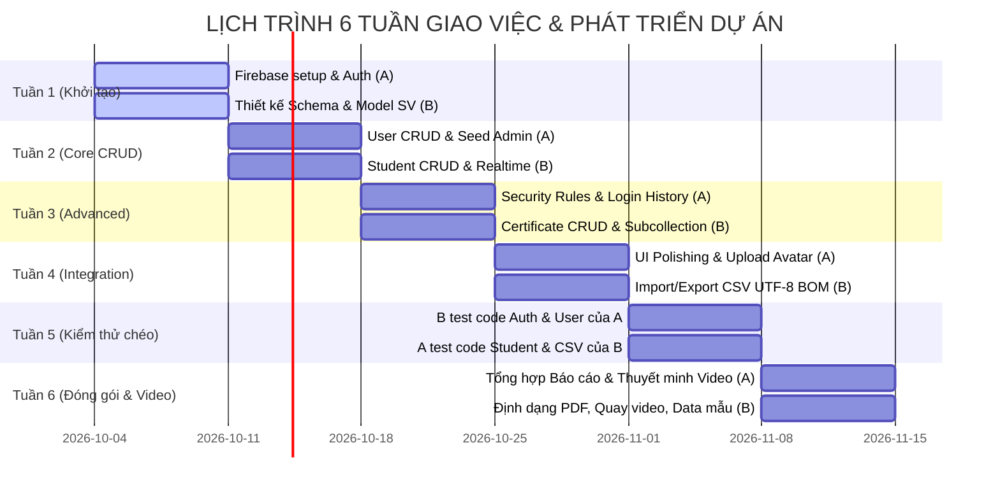

# Phân Công Công Việc Nhóm & Ma Trận Trách Nhiệm (RACI)

> **Dự án:** Ứng dụng Quản lý Thông tin Sinh viên Thời gian Thực (Realtime Student Management)  
> **Môn học:** Phát triển ứng dụng di động – Mã HP: 503074  
> **Thời gian thực hiện:** 6 tuần (04/10/2026 → 14/11/2026)  
> **Mục đích tài liệu:** Bản kế hoạch chính thức **để giao việc** cho từng thành viên, phân định rõ ràng quyền hạn và trách nhiệm nghiệm thu chéo.  
> **Nguyên tắc phân công:** Đảm bảo khối lượng công việc cân bằng tuyệt đối (50% - 50%), minh bạch vai trò Owner (người thực hiện chính) và Reviewer (người kiểm thử chéo và duyệt code).

---

## 1. Thông Tin Thành Viên & Phân Cấp Trách Nhiệm

| Định danh | Vai trò | Họ và tên | Mã số sinh viên (MSSV) | Email sinh viên | Phạm vi phụ trách chính |
|:---:|:---:|---|---|---|---|
| **Thành viên A** | Trưởng nhóm | Tan (Trần Ngọc Tân) | 52400158 | 52400158@student.tdtu.edu.vn | Kiến trúc hệ thống, Authentication, User Management, Security Rules, UI Auth/User, Tổng hợp Báo cáo |
| **Thành viên B** | Thành viên | `[HỌ VÀ TÊN THÀNH VIÊN B]` | `[MSSV THÀNH VIÊN B]` | `[EMAIL THÀNH VIÊN B]` | Schema dữ liệu, Student & Certificate CRUD, Realtime Sync, Import/Export CSV, UI Sinh viên, Dữ liệu Demo & Quay Video |

---

## 2. Ma Trận Phân Công Giao Việc & Kiểm Thử Chéo (RACI & Cross-Review)

Để đảm bảo tính khách quan và chất lượng mã nguồn cao nhất, dự án áp dụng quy tắc **kiểm thử chéo bắt buộc**: Người lập trình tính năng (Owner) **không được tự duyệt/test nghiệm thu tính năng của mình**; người còn lại (Reviewer) sẽ thực hiện kiểm thử độc lập và phê duyệt.

| STT | Hạng mục công việc (Task Description) | Owner (Chính) | Reviewer / Cross-Tester | Test Cases liên quan | Branch / PR | Đầu ra cụ thể (Deliverable) | Trạng thái |
|:---:|---|:---:|:---:|:---:|:---:|---|:---:|
| **1** | Thiết lập Firebase Project, Firebase Auth & Seed Admin | **A** | **B** | TC-01, TC-02, TC-26 | `feature/auth-seed` | `FirebaseClient.java`, `AuthRepository.java`, `AdminSeedService.java`, tài khoản `admin@student.app` | Đã giao việc |
| **2** | Quản lý người dùng (User CRUD), Khóa/Mở khóa & Lịch sử đăng nhập | **A** | **B** | TC-03, TC-05, TC-06, TC-08, TC-22, TC-23 | `feature/user-management` | `UserRepository.java`, `UserViewModel.java`, `UserListFragment.java`, `LoginHistoryFragment.java` | Đã giao việc |
| **3** | Xây dựng Cloud Firestore Security Rules & Storage Rules | **A** | **B** *(Bắt buộc review)* | TC-07, TC-10, TC-15, TC-20 | `security/firebase-rules` | `firestore.rules`, `storage.rules`, `firebase.json` đã kiểm tra chặn trái phép | Đã giao việc |
| **4** | Giao diện Auth, Quản lý tài khoản, Hồ sơ cá nhân & Upload Avatar | **A** | **B** | TC-04, TC-08 | `ui/auth-profile` | `activity_login.xml`, `fragment_user_list.xml`, `fragment_profile.xml`, tải ảnh lên Firebase Storage | Đã giao việc |
| **5** | Thiết kế Schema dữ liệu Firestore & CRUD Sinh viên | **B** | **A** | TC-09, TC-11, TC-12, TC-13 | `feature/student-crud` | `Student.java`, `StudentRepository.java`, `StudentViewModel.java`, `StudentListFragment.java` | Đã giao việc |
| **6** | Quản lý Chứng chỉ sinh viên (1-N Subcollection) & Cascade Delete | **B** | **A** | TC-14, TC-15, TC-25 | `feature/certificate-crud` | `Certificate.java`, `CertificateRepository.java`, cơ chế xóa sạch subcollection khi xóa SV | Đã giao việc |
| **7** | Nhập / Xuất dữ liệu CSV (Hỗ trợ tiếng Việt UTF-8 BOM, Batching >500 dòng) | **B** | **A** | TC-16, TC-17, TC-18, TC-19, TC-24, TC-27 | `feature/csv-io` | `CsvHelper.java`, `ImportExportFragment.java`, `sample-data/`, phân lô batch 400 docs/lần | Đã giao việc |
| **8** | Giao diện Sinh viên, Chi tiết, Chứng chỉ, Skeleton Loading, Tìm kiếm | **B** | **A** | TC-09, TC-11, TC-14 | `ui/student-certificate` | `fragment_student_detail.xml`, `item_student.xml`, `item_student_skeleton.xml` | Đã giao việc |
| **9** | Kiểm thử độc lập: Module Auth, Người dùng & Phân quyền RBAC | **B** *(Test code của A)* | **A** *(Sửa nếu có bug)* | TC-01 đến TC-08, TC-22, TC-23 | `test/auth-rbac` | Biên bản kiểm thử Auth/RBAC, 100% test case pass | Đã giao việc |
| **10** | Kiểm thử độc lập: Module Sinh viên, Chứng chỉ, CSV & Đồng bộ Realtime | **A** *(Test code của B)* | **B** *(Sửa nếu có bug)* | TC-09 đến TC-21, TC-24, TC-25, TC-27 | `test/student-csv` | Biên bản kiểm thử Student/CSV, 100% test case pass | Đã giao việc |
| **11** | Soạn thảo Báo cáo: Chương Auth, Quản lý người dùng, Bảo mật, Kiến trúc | **A** | **B** | Toàn bộ chương | `docs/report-part1` | Báo cáo chi tiết Chương 1, 3, 4, 5.1, 5.2 | Đã giao việc |
| **12** | Soạn thảo Báo cáo: Nghiên cứu sâu Firestore, Sinh viên, CSV, Tối ưu | **B** | **A** | Toàn bộ chương | `docs/report-part2` | Báo cáo chi tiết Chương 2, 5.3, 5.4, 6 | Đã giao việc |
| **13** | Sản xuất Video Demo: Chuẩn bị kịch bản, Thiết bị, Data demo, Quay & Thuyết minh | **Cả hai** | **Cả hai** | Toàn bộ kịch bản 20p | `media/demo-video` | **A:** Thuyết minh và trình bày ứng dụng.   **B:** Chuẩn bị kịch bản, bộ data mẫu, điều phối thiết bị 2 và quay phim. | Đã giao việc |

---

## 3. Lịch Trình Kế Hoạch 6 Tuần & Cân Bằng Khối Lượng

---

## 4. Bảng Phân Bổ Khối Lượng Giờ Dự Kiến (Kế hoạch 50% - 50%)

Theo dõi chi tiết tại bảng tính: [`../project-progress.xlsx`](../project-progress.xlsx).

| Thành viên | Giờ dự kiến | Giờ thực tế | Tỷ lệ khối lượng % | Đánh giá cân bằng |
|---|:---:|:---:|:---:|:---:|
| **Thành viên A (Tan)** | 60 giờ | `0 giờ` | **50.0%** | ✅ CÂN BẰNG |
| **Thành viên B** | 60 giờ | `0 giờ` | **50.0%** | ✅ CÂN BẰNG |
| **Tổng cộng dự án** | **120 giờ** | `0 giờ` | **100%** | Sẵn sàng triển khai |

---

## 5. Quy Chuẩn Đóng Góp & Nghiệm Thu (Definition of Done)

1. **Commit Message:** Tuân thủ quy ước Conventional Commits (ví dụ: `feat(auth): ...`, `fix(student): ...`, `test(csv): ...`).
2. **Pull Request:** Mỗi PR phải gắn kèm ít nhất 1 test case liên quan và phải được thành viên còn lại review, chạy thử trước khi merge vào nhánh `master`.
3. **Tiêu chuẩn hoàn thành:** Tính năng chỉ được chuyển từ `CẦN LÀM` sang `HOÀN THÀNH` khi:
   - Đã viết mã nguồn và biên dịch thành công không có lỗi.
   - Test case liên quan trên cả máy ảo và thiết bị thật đạt trạng thái `PASS`.
   - Security Rules đã được kiểm tra trên Firebase Console Simulator.
   - Tài liệu kỹ thuật tương ứng đã được cập nhật đồng bộ.
