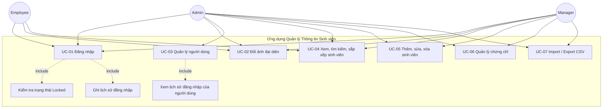
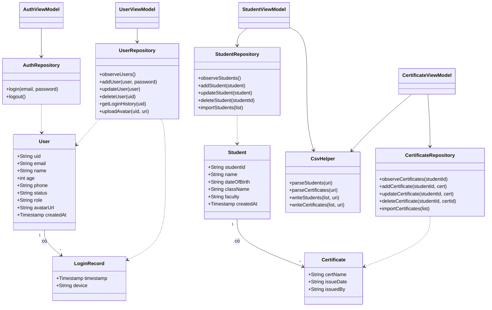
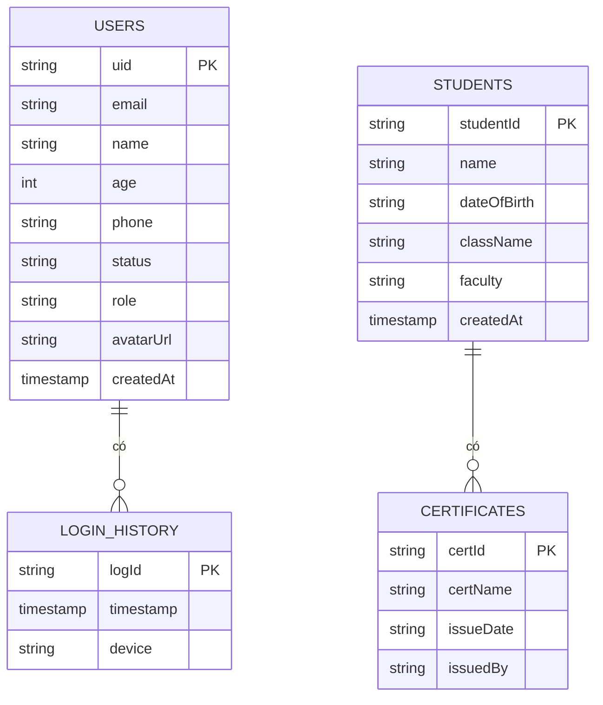
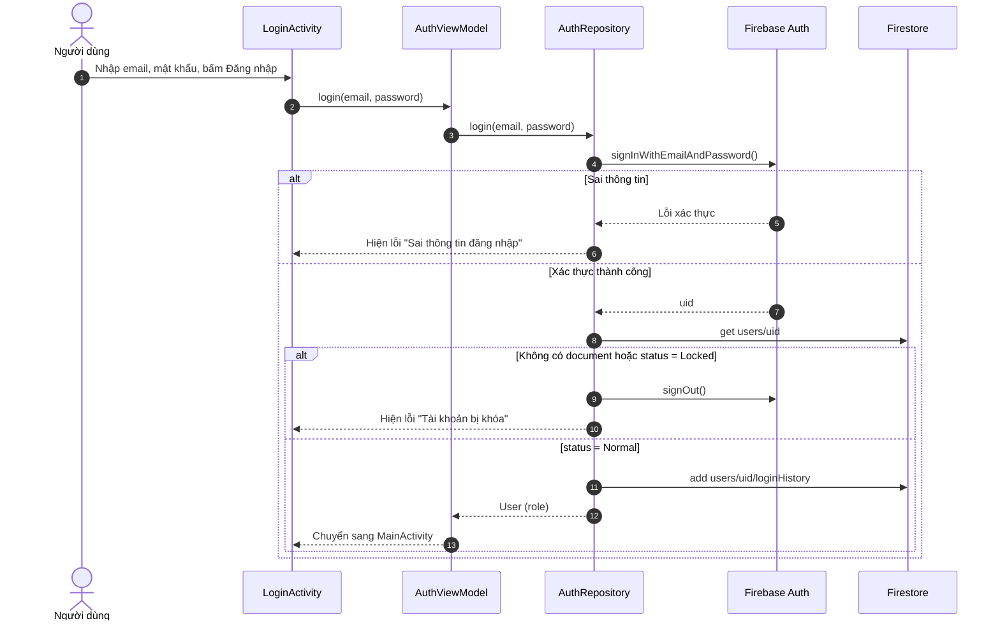
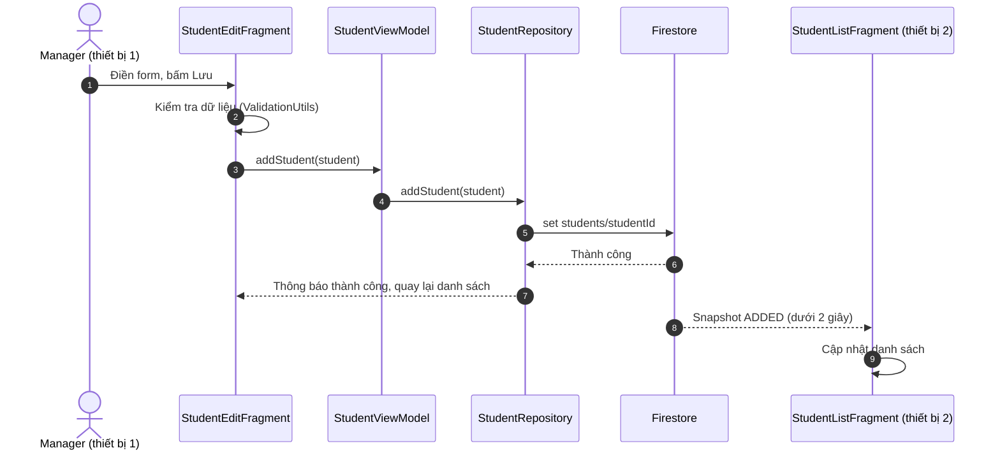
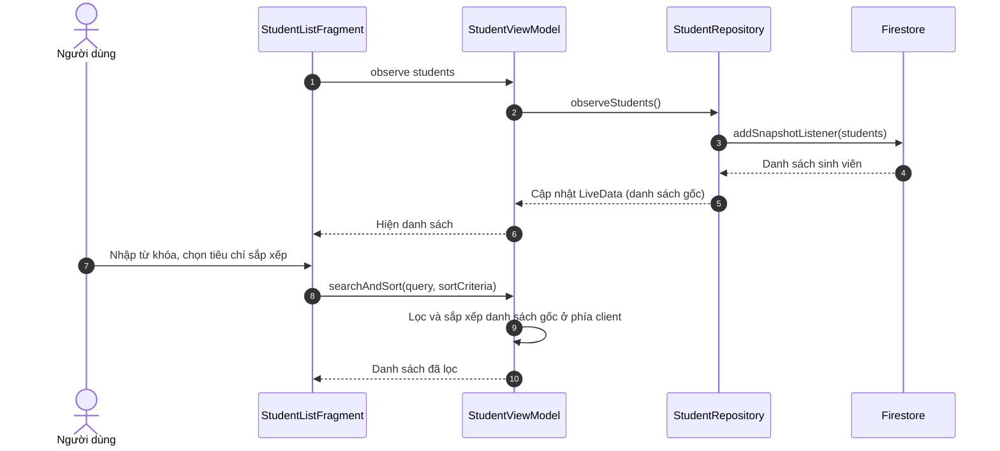
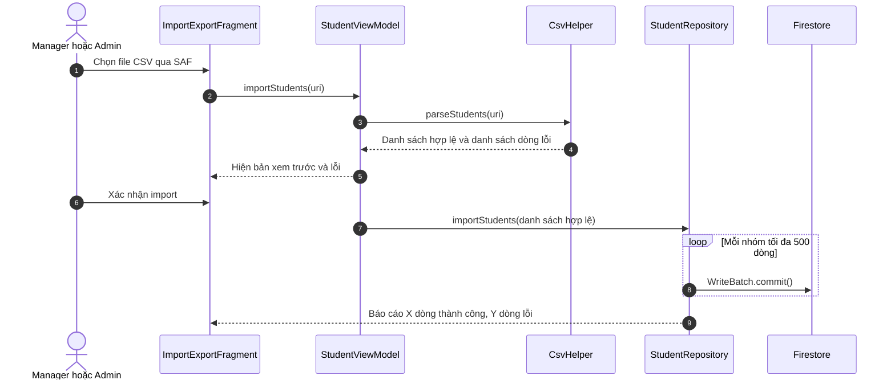
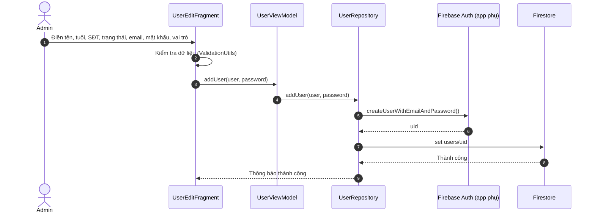

# Biểu Đồ UML

Tên lớp, màn hình và trường dữ liệu trong các biểu đồ khớp với [`design.md`](design.md) và [`firestore-schema.md`](firestore-schema.md).

## 1. Biểu đồ Use Case

*Hình 1: Biểu đồ use case. Employee chỉ xem và đổi ảnh đại diện.*

## 2. Biểu đồ lớp

*Hình 2: Biểu đồ lớp chính (model, repository, ViewModel, tiện ích CSV).*

## 3. Mô hình dữ liệu Firestore (ER)

*Hình 3: Sơ đồ dữ liệu Firestore (collection và subcollection).*

## 4. Biểu đồ tuần tự

### 4.1 Đăng nhập và điều hướng theo vai trò

*Hình 4: Luồng đăng nhập, kiểm tra khóa và ghi lịch sử.*

### 4.2 Thêm sinh viên và đồng bộ thời gian thực

*Hình 5: Thêm sinh viên và cập nhật tức thì trên thiết bị khác.*

### 4.3 Tìm kiếm và sắp xếp

*Hình 6: Tìm kiếm và sắp xếp phía client trên dữ liệu thời gian thực.*

### 4.4 Import sinh viên từ CSV

*Hình 7: Luồng import sinh viên từ CSV.*

### 4.5 Admin thêm người dùng

*Hình 8: Admin tạo tài khoản mới. Dùng FirebaseApp phụ để Admin không bị đăng xuất.*
