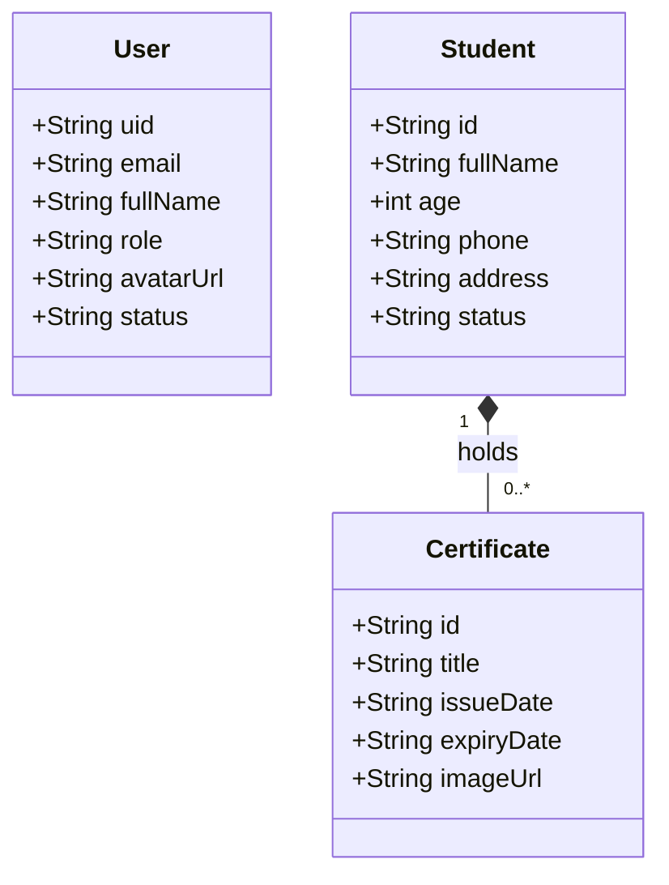
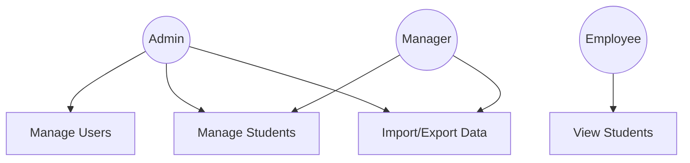

# UML Diagrams

## 1. Class Diagram

```mermaid
classDiagram
    class User {
        +String uid
        +String email
        +String fullName
        +String role
        +String avatarUrl
        +String status
    }

    class Student {
        +String id
        +String fullName
        +int age
        +String phone
        +String address
        +String status
    }

    class Certificate {
        +String id
        +String title
        +String issueDate
        +String expiryDate
        +String imageUrl
    }

    Student "1" *-- "0..*" Certificate : holds
```

## 2. Use Case Diagram

```mermaid
graph TD
    Admin((Admin))
    Manager((Manager))
    Employee((Employee))

    Admin --> UC1[Manage Users]
    Admin --> UC2[Manage Students]
    Manager --> UC2
    Employee --> UC3[View Students]
    Admin --> UC4[Import/Export Data]
    Manager --> UC4
```
